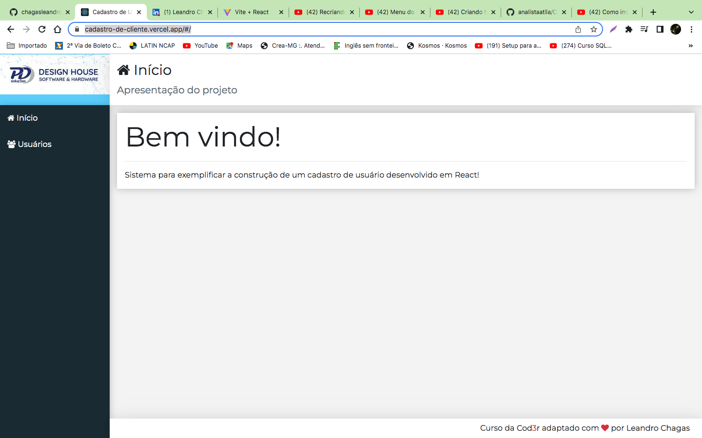

  <a href="#-tecnologias">Tecnologias</a>&nbsp;&nbsp;&nbsp;|&nbsp;&nbsp;&nbsp;
  <a href="#-projeto">Projeto</a>&nbsp;&nbsp;&nbsp;|&nbsp;&nbsp;&nbsp;
  <a href="#-layout">Layout</a>&nbsp;&nbsp;&nbsp;|&nbsp;&nbsp;&nbsp;
  <a href="#memo-licença">Licença</a>

 

  

 

## 🚀 Tecnologias

Esse projeto foi desenvolvido com as seguintes tecnologias:

- HTML
- CSS
- JavaScript

## Projeto

Cadastro de Usuários

Um simples CRUD feito com React, Bootstrap, HTML5 e CSS3 com seu sistema de grids.

  

## Instalação

* Baixar o NPM e o Node

* Abrir o projeto em uma IDE de preferência ou no terminal do sistema operacional

  * `npm install`

  * `json-server -p 3001 db.json`

  * `npm start`
  
* Caso a aplicação rode normalmente, estará disponível em `localhost:3000`
